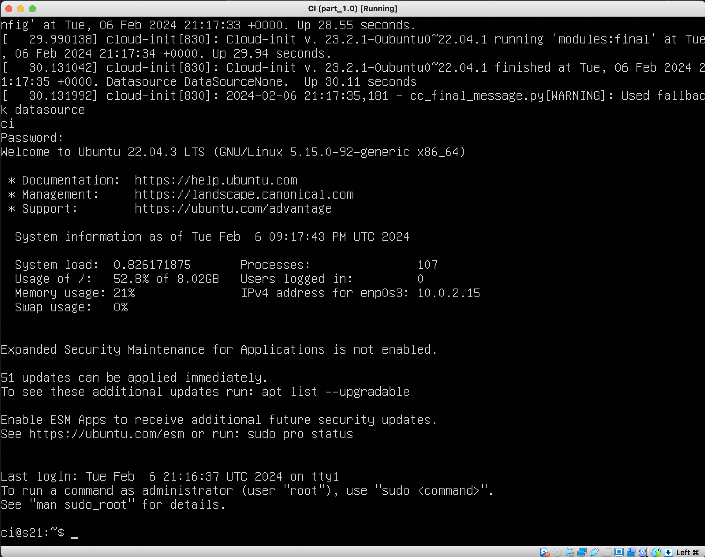
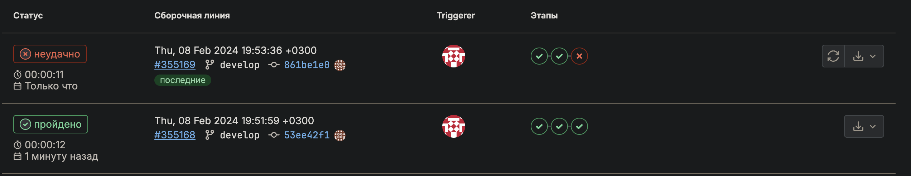
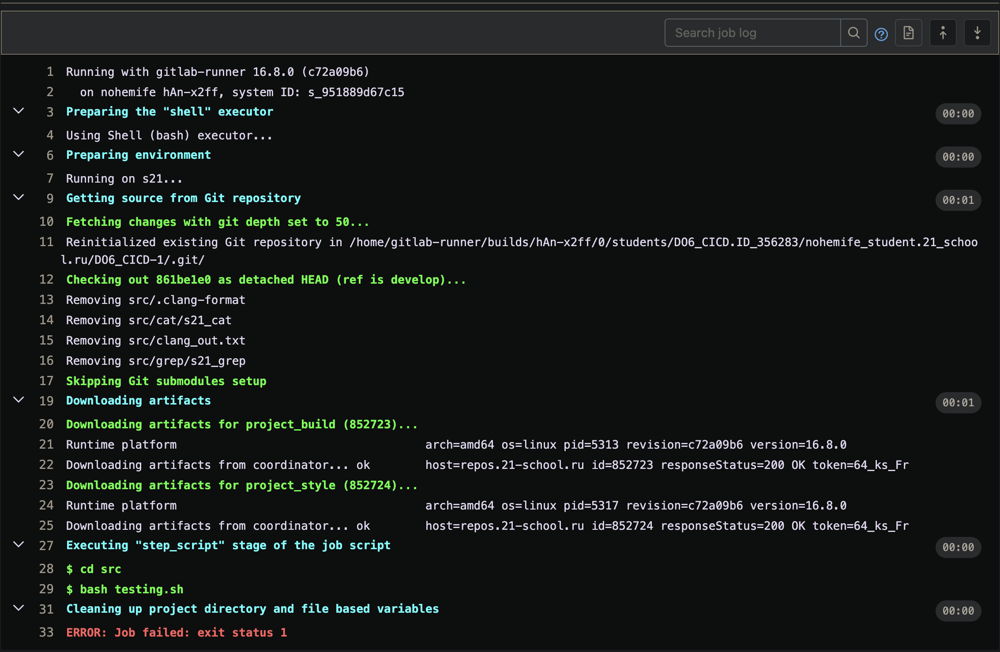
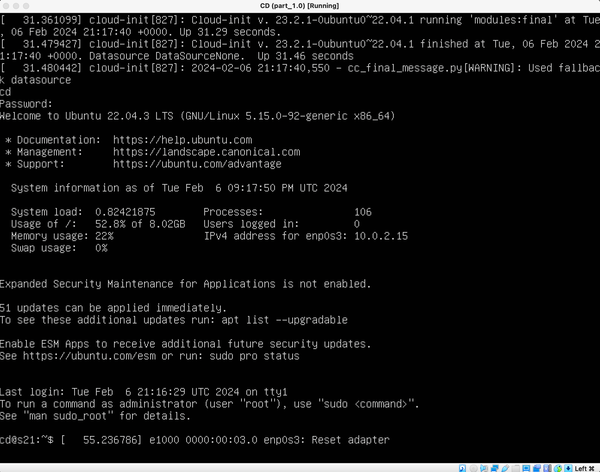
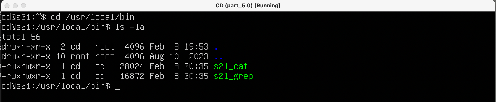

### Part 1. Настройка **gitlab-runner**

**== Задание ==**

##### Подними виртуальную машину _Ubuntu Server 22.04 LTS_.


_Будь готов, что в конце проекта нужно будет сохранить дамп образа виртуальной машины._

##### Скачай и установи на виртуальную машину **gitlab-runner**.

1. Добавим репозиторий GitLab в список источников APT:

```
curl -L https://packages.gitlab.com/install/repositorie /runner/gitlab-runner/script.deb.sh | sudo bash
```


2. Установим GitLab Runner:

```
sudo apt-get install gitlab-runner
```

 3. Запустим GitLab Runner и узнаем статус:

```
sudo gitlab-runner start
sudo gitlab-runner status
```

 4. Зарегистрируем GitLab Runner:

```
sudo gitlab-runner register
```


##### Запусти **gitlab-runner** и зарегистрируй его для использования в текущем проекте (_DO6_CICD_).

- Для регистрации понадобятся URL и токен, которые можно получить на страничке задания на платформе.

При регистрации, следуйте инструкциям на экране.

`Hужно будет ввести URL GitLab, токен регистрации и выбрать тип регистрации (по умолчанию, это регистрация с помощью токена).
После завершения регистрации, GitLab Runner будет готов к выполнению задач на сервере.`

### Part 2. Сборка

**== Задание ==**

#### Напиши этап для **CI** по сборке приложений из проекта _C2_SimpleBashUtils_.

##### В файле _gitlab-ci.yml_ добавь этап запуска сборки через мейк файл из проекта _C2_.

##### Файлы, полученные после сборки (артефакты), сохрани в произвольную директорию со сроком хранения 30 дней.


Установим в виртуальную машину, необходимые программы:

```
sudo apt update
sudo apt install gcc -y
sudo apt install clang-format -y
sudo apt install make -y
sudo apt install git -y
```


### Part 3. Тест кодстайла

**== Задание ==**

#### Напиши этап для **CI**, который запускает скрипт кодстайла (_clang-format_).


##### Если кодстайл не прошел, то «зафейли» пайплайн.


##### В пайплайне отобрази вывод утилиты _clang-format_.


### Part 4. Интеграционные тесты

**== Задание ==**

#### Напиши этап для **CI**, который запускает твои интеграционные тесты из того же проекта.


##### Запусти этот этап автоматически только при условии, если сборка и тест кодстайла прошли успешно.


##### Если тесты не прошли, то «зафейли» пайплайн.




##### В пайплайне отобрази вывод, что интеграционные тесты успешно прошли / провалились.


### Part 5. Этап деплоя

**== Задание ==**

##### Подними вторую виртуальную машину _Ubuntu Server 22.04 LTS_.



#### Напиши этап для **CD**, который «разворачивает» проект на другой виртуальной машине.


Настроим статическую сеть на виртуальных машинах.


Создадим на второго пользователь gitlab-runner на виртуальной машине ci@s21. Создадим ключ доступа и настроим доступ по ssh.

```
sudo su gitlab-runner
ssh-keygen -t rsa -b 2048
ssh-copy-id cd@192.168.100.11
ssh cd@192.168.100.11
```

На виртуальной машине cd@s21 так же создадим ключ и настроим доступ.

```
ssh-keygen -t rsa -b 2048
ssh-copy-id ci@192.168.100.10
sudo chown -R $(whoami) /usr/local/bin
```

`Команда sudo chown -R $(whoami) /usr/local/bin в Linux используется для изменения владельца и группу всех файлов и каталогов в директории /usr/local/bin на текущего пользователя, который исполняет эту команду. `

##### Запусти этот этап вручную при условии, что все предыдущие этапы прошли успешно.


##### Напиши bash-скрипт, который при помощи **ssh** и **scp** копирует файлы, полученные после сборки (артефакты), в директорию _/usr/local/bin_ второй виртуальной машины.

_Тут тебе могут помочь знания, полученные в проекте DO2_LinuxNetwork._

- Будь готов объяснить по скрипту, как происходит перенос.


##### В файле _gitlab-ci.yml_ добавь этап запуска написанного скрипта.

##### В случае ошибки «зафейли» пайплайн.

В результате ты должен получить готовые к работе приложения из проекта _C2_SimpleBashUtils_ (s21_cat и s21_grep) на второй виртуальной машине.




##### Сохрани дампы образов виртуальных машин.

**P.S. Ни в коем случае не сохраняй дампы в гит!**

- Не забудь запустить пайплайн с последним коммитом в репозитории.

### Part 6. Дополнительно. Уведомления

**== Задание ==**

##### Настрой уведомления о успешном/неуспешном выполнении пайплайна через бота с именем «[твой nickname] DO6 CI/CD» в _Telegram_.


